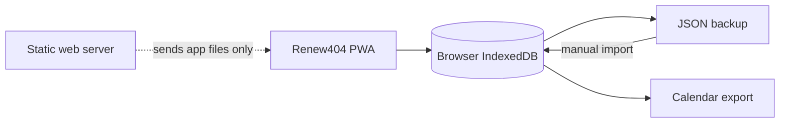
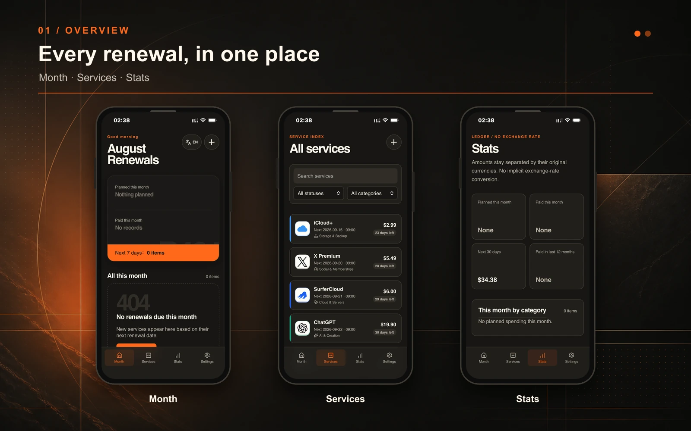
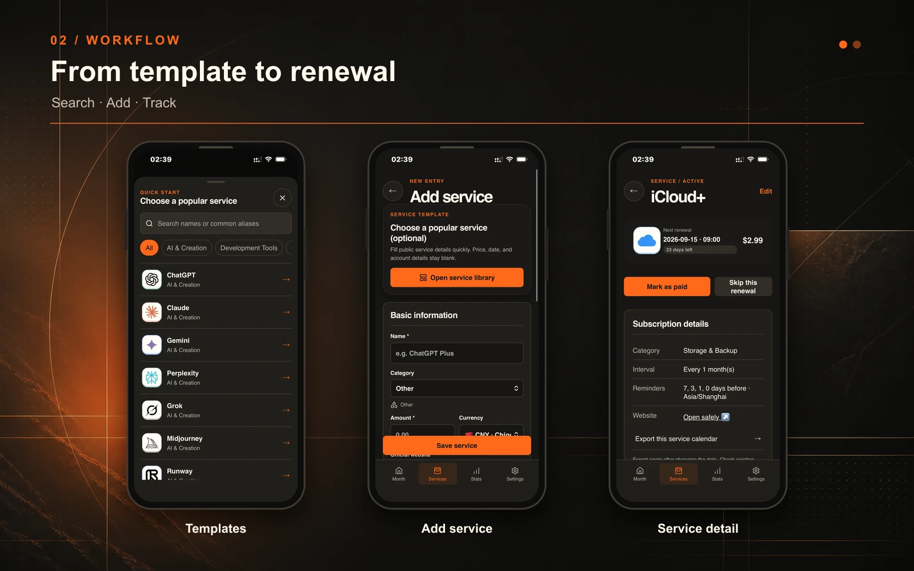
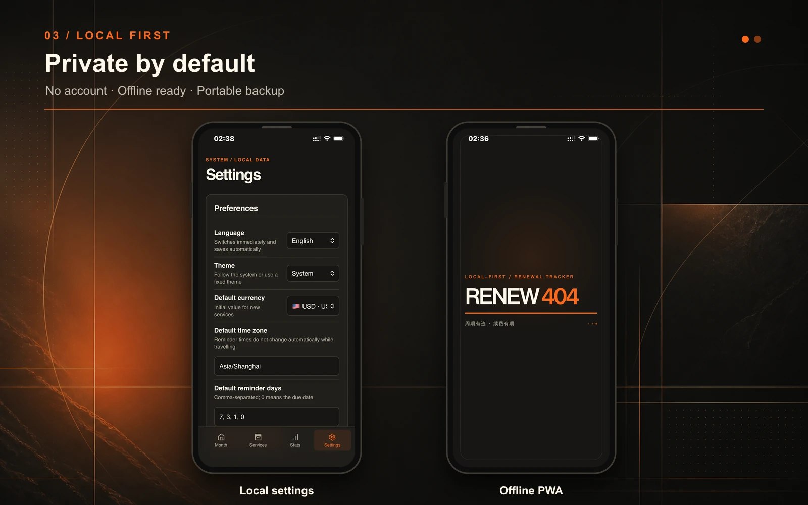

<p align="center">
  
</p>

<p align="center">
  <strong>Renew404 Subscription Manager — a private, focused renewal tracker that runs entirely in your browser.</strong>
</p>

<p align="center">
  <a href="https://renew.try404.com/">Live demo</a> ·
  <a href="README.md">简体中文</a> ·
  <a href="#install-as-an-app">Install as an app</a> ·
  <a href="#self-hosting">Self-host</a>
</p>

<p align="center">
  <a href="https://github.com/Mavlan/renew404/actions/workflows/ci.yml"></a>
  
  
  
  <a href="LICENSE"></a>
</p>

## Why Renew404?

I always wanted a simple app that remembers subscriptions and renewal dates. Most expense trackers can do it, but they felt too heavy for this one job: accounts, memberships, cloud sync, and a lot of bookkeeping I did not need.

A renewal tracker should be able to run in a browser. It should open without registration, work without a subscription fee, and never require you to hand your personal renewal records to an application server. That is why Renew404 exists.

Open it and start. Install it as a PWA if you want an app-like experience. Your records remain in IndexedDB on that device until you choose to export them.

## What it does

| Focused renewal tracking                                                | Private by design                                        |
| ----------------------------------------------------------------------- | -------------------------------------------------------- |
| Next renewal date, days remaining, price, currency, and payment history | No login, cloud sync, analytics, ads, or online logo API |
| Searchable service templates and 17 stable categories                   | Records stay in browser IndexedDB                        |
| Local brand logos with deterministic category/initial fallbacks         | Manual, portable JSON backup with legacy import support  |
| Calendar export for system-level reminders                              | Fully usable after the PWA shell has been cached         |
| Simplified Chinese, Traditional Chinese, English, and Japanese          | Self-hostable as static files on any HTTPS server        |

Renew404 intentionally does **not** fetch exchange rates or merge unlike currencies. It does **not** run reminder jobs after the PWA is closed; precise reminders are delegated to exported calendar events.

## How your data moves



The application has no backend API for subscription records. A hosting provider may still retain ordinary HTTP request metadata according to its server configuration; see [Privacy](PRIVACY.md) for the precise boundary.

## Product tour







## Install as an app

The website works directly in a normal browser. Installing the PWA is recommended on phones because it gets its own home-screen icon and standalone window.

### iPhone and iPad

1. Open `https://renew.try404.com/` in Safari.
2. Tap **Share**.
3. Choose **Add to Home Screen**.
4. Enable **Open as Web App** if that option is shown, then tap **Add**.

See Apple's official [Turn a website into an app in Safari](https://support.apple.com/guide/iphone/open-as-web-app-iphea86e5236/ios) guide.

### Android

1. Open `https://renew.try404.com/` in Chrome, Edge, or Samsung Internet.
2. Open the browser menu.
3. Choose **Install app** or **Add to Home screen**; the wording varies by browser and device.
4. Launch Renew404 from the new home-screen or app-launcher icon.

Use a full browser rather than an in-app browser inside a social or messaging app. Depending on the browser and device, Android may install a WebAPK or a browser-managed shortcut; both launch the PWA without requiring a separately distributed APK. More detail is available in web.dev's [PWA installation guide](https://web.dev/learn/pwa/installation).

## Local development

Requirements: Node.js 24 and pnpm 11 or later.

```bash
git clone https://github.com/Mavlan/renew404.git
cd renew404
pnpm install
pnpm dev
```

Production checks:

```bash
pnpm lint
pnpm test
pnpm build
pnpm e2e
```

Install Playwright Chromium once before the first E2E run:

```bash
pnpm exec playwright install chromium
```

## Self-hosting

If you do not want to self-host, use the public instance provided by Try404 at [renew.try404.com](https://renew.try404.com/). It opens without registration, and your subscription data still remains in this browser on your device.

Renew404 is a static Vue PWA. Build it, then serve the complete `dist/` directory from an HTTPS origin:

```bash
pnpm build
```

The server must:

- fall back unknown routes to `index.html`;
- avoid long-term caching for `index.html`, `sw.js`, and `manifest.webmanifest`;
- serve hashed assets with immutable caching;
- expose the site over HTTPS so service workers and installation work correctly.

An Nginx example is provided in [deploy/nginx.conf](deploy/nginx.conf).

### 1Panel release package

On Windows, use the project release command rather than PowerShell `Compress-Archive`:

```powershell
pnpm release:1panel
```

It runs lint, unit tests, build, and mobile E2E, then creates a Linux-safe ZIP whose hashed resources are written before `index.html` and `sw.js`. During deployment, overwrite the complete build without deleting the old hashed assets first.

## Data compatibility

- Dexie database version 2 migrates existing records without clearing services, payments, or settings.
- The stable system category ID for “Other” is `other`; unmatched legacy names become local custom categories.
- JSON backup format remains `renew404-backup` version 1.
- Old backups without `categories`, `categoryId`, `iconKey`, or `locale` remain importable.
- Templates accelerate data entry but saved services never depend on template definitions.
- Unknown or removed `iconKey` values use the normal category/initial fallback.

Before changing migrations or backup behavior, read [Contributing](CONTRIBUTING.md).

## Technology

- Vue 3, TypeScript, Vite, and Pinia
- Dexie / IndexedDB
- vite-plugin-pwa and Workbox
- Vitest and Playwright
- Lucide plus a local, explicit brand-logo whitelist

## Project boundaries

Renew404 stays intentionally small. Cloud accounts, automatic sync, analytics, advertising, payment integration, online logo fetching, and live exchange-rate APIs are outside the current product scope.

<!-- Insert the supplied support QR section here before the public announcement. -->

## Contributing and security

Bug reports, translations, accessibility fixes, accurate service templates, and compatibility-preserving improvements are welcome. Read [CONTRIBUTING.md](CONTRIBUTING.md) before opening a pull request. Please report vulnerabilities privately according to [SECURITY.md](SECURITY.md).

Brand names and logos belong to their respective owners and are used only for service identification. See [Third-party notices](THIRD_PARTY_NOTICES.md).

## License

Renew404 source code is available under the [MIT License](LICENSE).
