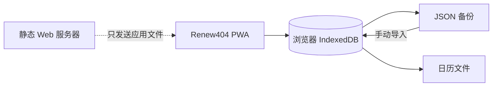
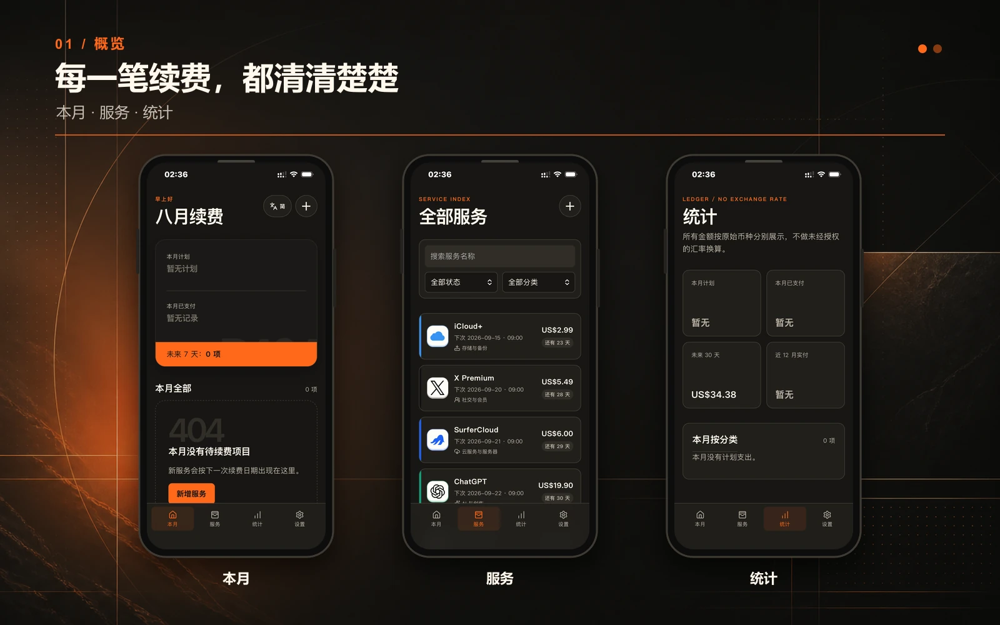
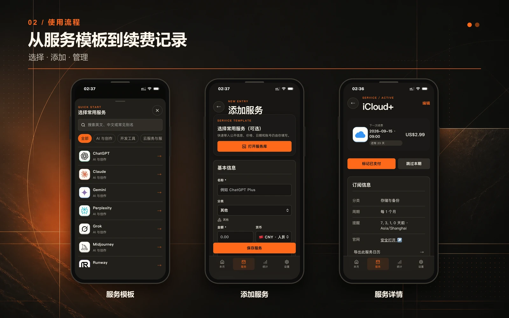
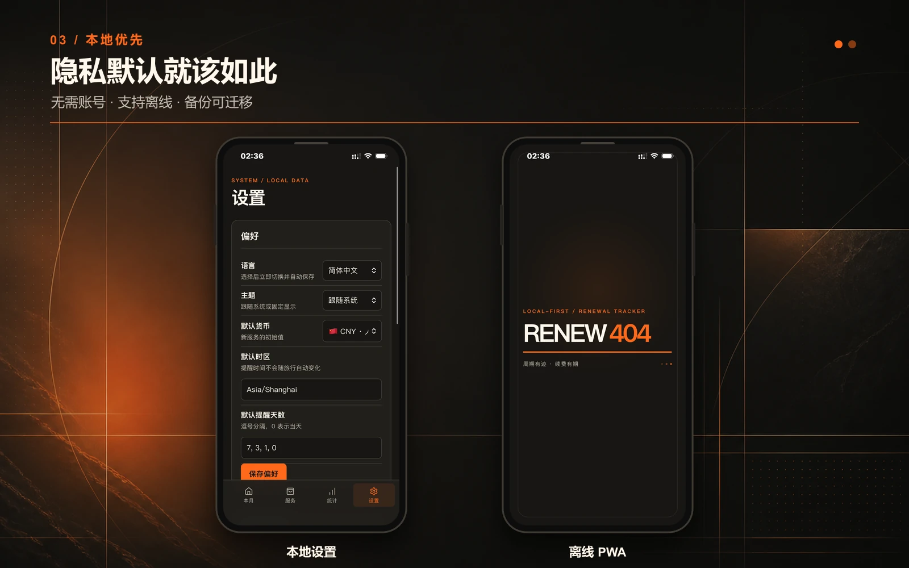

<p align="center">
  
</p>

<p align="center">
  <strong>Renew404 订阅管家——一个只专注订阅与续费日期、完全在浏览器中运行的隐私友好工具。</strong>
</p>

<p align="center">
  <a href="https://renew.try404.com/">在线使用</a> ·
  <a href="README.en.md">English</a> ·
  <a href="#安装成-app">安装成 App</a> ·
  <a href="#自行部署">自行部署</a>
</p>

<p align="center">
  <a href="https://github.com/Mavlan/renew404/actions/workflows/ci.yml"></a>
  
  
  
  <a href="LICENSE"></a>
</p>

## 为什么做 Renew404？

我一直想找一个专门记录订阅和续费日期的 App。试过不少收支管理工具，它们通常也能记录订阅，但对我来说太臃肿：需要注册、需要开会员、依赖云同步，还混合了大量我不需要的记账功能。

订阅记录本质上并不复杂。它应该打开浏览器就能用，不需要账号，不需要再为“记录订阅”这件事付一次订阅费，也不应该要求用户把自己的续费记录交给一台应用服务器。

所以我做了 Renew404：打开就能用；想获得更像 App 的体验，可以安装成 PWA；所有记录默认只保存在这台手机或电脑的浏览器 IndexedDB 中，除非你自己主动导出。

## 它能做什么

| 专注续费管理                               | 隐私是默认设置                       |
| ------------------------------------------ | ------------------------------------ |
| 下一次续费、剩余天数、金额、币种和付款历史 | 无需登录、没有云同步、分析追踪或广告 |
| 可搜索的服务模板和 17 个稳定分类           | 记录保存在浏览器 IndexedDB           |
| 本地品牌 Logo，以及明确的分类/首字母回退   | 手动、可迁移的 JSON 备份，兼容旧文件 |
| 导出系统日历，使用手机原生提醒             | 缓存应用后可离线查看和编辑           |
| 简体中文、繁體中文、English、日本語        | 构建后是纯静态文件，可自行部署       |

Renew404 不请求实时汇率，也不会把不同币种擅自合并。PWA 关闭后不会在服务器执行提醒任务；需要精确通知时，请把续费计划导出到系统日历。

## 数据去了哪里



应用没有接收订阅记录的后端 API。托管服务仍可能按照服务器配置保存普通 HTTP 请求信息；准确边界请查看[隐私说明](PRIVACY.md)。

## 产品预览







## 安装成 App

Renew404 在普通浏览器里可以直接使用。手机用户更推荐安装 PWA：它会拥有独立桌面图标和单独窗口，使用感受更接近原生 App。

### iPhone / iPad

1. 用 Safari 打开 `https://renew.try404.com/`。
2. 点击“分享”。
3. 选择“添加到主屏幕”。
4. 如果出现“作为网页 App 打开”，保持开启，然后点击“添加”。

可参考 Apple 官方的[在 iPhone 上将网站变成 App](https://support.apple.com/zh-cn/guide/iphone/iphea86e5236/ios)说明。

### Android

1. 用 Chrome、Edge 或三星浏览器打开 `https://renew.try404.com/`。
2. 打开浏览器菜单。
3. 选择“安装应用”或“添加到主屏幕”；不同品牌和浏览器的名称可能略有区别。
4. 以后从桌面或应用列表里的 Renew404 图标启动。

建议使用完整浏览器，不要在微信等应用的内置浏览器里安装。根据手机和浏览器不同，Android 可能安装为 WebAPK，也可能创建由浏览器管理的桌面快捷方式；两者都不需要另行下载 APK。更多原理可查看 web.dev 的 [PWA 安装说明](https://web.dev/learn/pwa/installation?hl=zh-cn)。

## 本地开发

需要 Node.js 24 和 pnpm 11 或更高版本。

```bash
git clone https://github.com/Mavlan/renew404.git
cd renew404
pnpm install
pnpm dev
```

提交前完整验收：

```bash
pnpm lint
pnpm test
pnpm build
pnpm e2e
```

首次运行 E2E 前安装 Chromium：

```bash
pnpm exec playwright install chromium
```

## 自行部署

如果不想自行部署，可以直接使用 Try404 提供的在线版本：[renew.try404.com](https://renew.try404.com/)。打开即可使用，无需注册；你的订阅数据仍只保存在当前设备的浏览器中。

Renew404 是纯静态 Vue PWA。构建后，把完整 `dist/` 放到任意 HTTPS 静态服务器：

```bash
pnpm build
```

服务器需要满足：

- 未知路由回退到 `index.html`；
- `index.html`、`sw.js` 和 `manifest.webmanifest` 不使用长期缓存；
- 带 hash 的资源使用 immutable 长缓存；
- 必须使用 HTTPS，Service Worker 和 PWA 安装才能正常工作。

项目提供了 [Nginx 配置示例](deploy/nginx.conf)。

### 1Panel 发布包

在 Windows 上不要使用 PowerShell `Compress-Archive`，直接运行：

```powershell
pnpm release:1panel
```

命令会依次执行 lint、单元测试、构建和手机端 E2E，再生成 Linux 路径兼容的 ZIP；带 hash 的资源会先写入，`index.html` 和 `sw.js` 最后写入。部署时覆盖完整构建，但不要先删除服务器上旧的 hash 资源。

## 数据兼容承诺

- Dexie 数据库 v2 会无损迁移旧记录，不清空服务、付款或设置。
- “其他”的稳定系统分类 ID 为 `other`；无法匹配的旧分类名称会成为本地自定义分类。
- JSON 备份格式继续使用 `renew404-backup` version 1。
- 缺少 `categories`、`categoryId`、`iconKey` 或 `locale` 的旧备份仍可导入。
- 模板只负责快速填写，保存后的服务不依赖模板继续存在。
- 未知或已经移除的 `iconKey` 会正常回退到分类图标或名称首字母。

修改迁移或备份代码前，请先阅读[贡献指南](CONTRIBUTING.md)。

## 技术栈

- Vue 3、TypeScript、Vite、Pinia
- Dexie / IndexedDB
- vite-plugin-pwa、Workbox
- Vitest、Playwright
- Lucide 与显式维护的本地品牌 Logo 白名单

## 项目边界

Renew404 会继续保持轻量。本阶段不加入云端账号、自动同步、分析追踪、广告、支付接入、在线 Logo 抓取或实时汇率 API。

<!-- 公开发布前，在这里加入用户提供的“请我喝杯咖啡”二维码区域。 -->

## 贡献与安全

欢迎提交 Bug、翻译、无障碍改进、准确的服务模板，以及不破坏兼容性的功能优化。提交 PR 前请阅读 [CONTRIBUTING.md](CONTRIBUTING.md)。安全问题请按 [SECURITY.md](SECURITY.md) 私下报告。

品牌名称和 Logo 仅用于识别服务，相关权利归各自所有者；详情见[第三方声明](THIRD_PARTY_NOTICES.md)。

## 许可证

Renew404 源代码使用 [MIT License](LICENSE) 开放。
